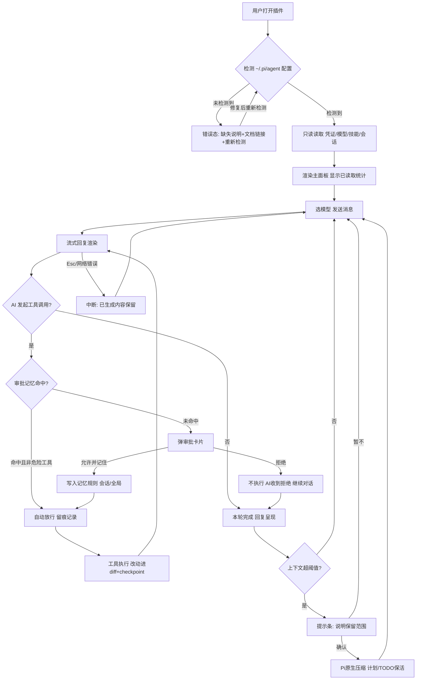
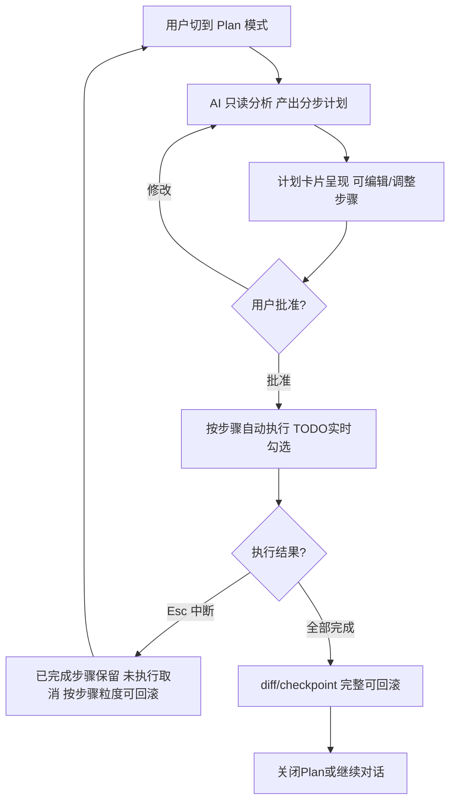
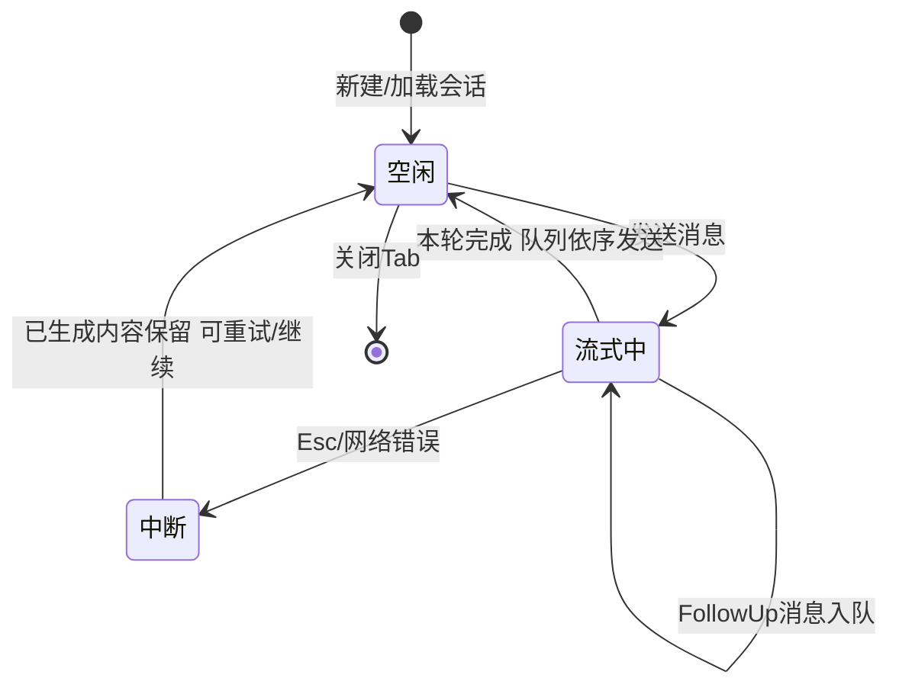
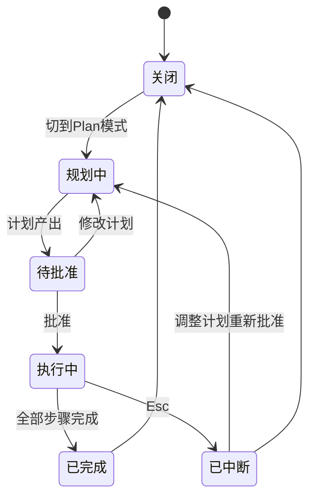
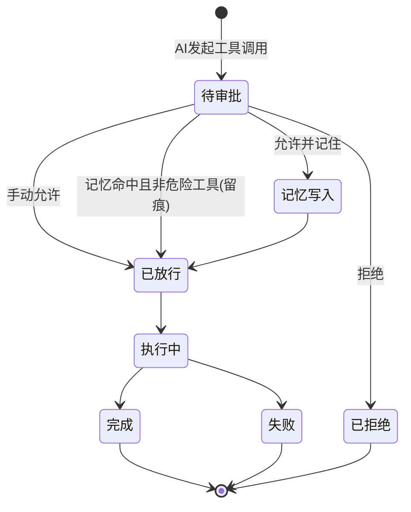
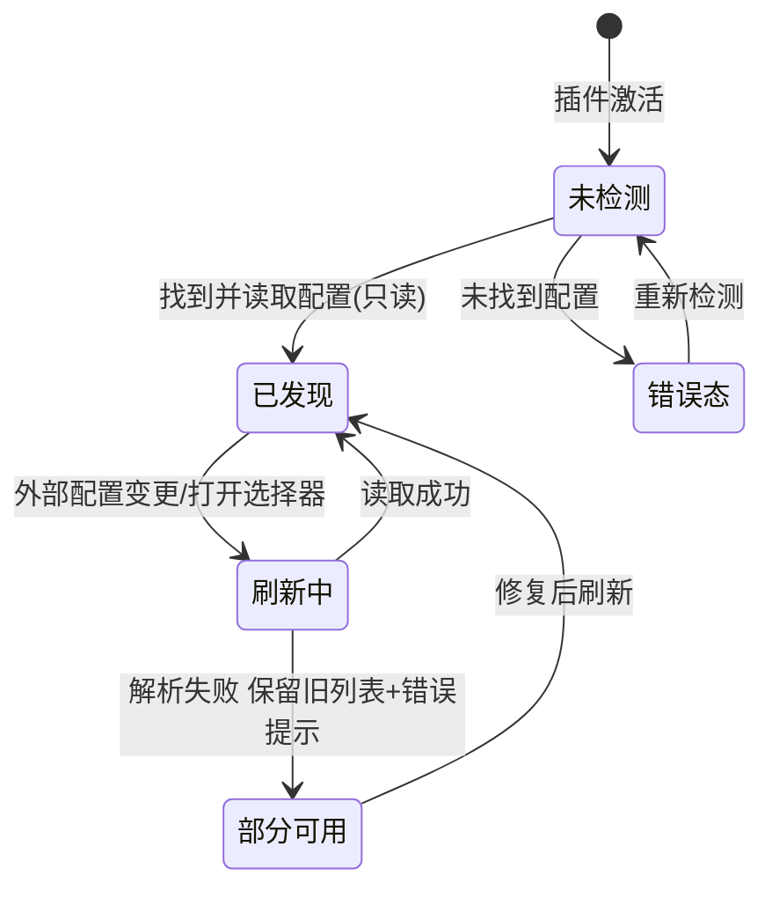

# PRD.md（草稿版）

> 草稿 = 骨架完整、内容简短。本文件与正式 PRD 同一文件演进：人工整体 review 通过后，Phase 5 在本文件基础上补全为正式 PRD。
> 状态：草稿 | 版本：v0.1 | 作者：Claude (sonnet-5) 与用户 grill-me 拷问收敛 | 需求：pi-vscode 对标 Copilot/Claude Code 产品级完善（Marketplace 发布）

## 1. 需求概述

### 1.1 需求背景

pi-vscode 目前是一个"能用的侧边栏聊天客户端"，但交互形态停留在聊天窗口内：无编辑器内交互（Inline Chat/右键菜单）、无上下文注入（@-mention）、代码块无高亮与 Apply、工具审批逐次弹卡无记忆、流式渲染长回复卡顿、无压缩自动化，且首次打开无 Pi 配置时是空白面板。对标 Copilot / Claude Code 的差距共 14 项（见 ROADMAP.md），无法作为正式产品发布到 VS Code Marketplace。方案是保留 Pi SDK 原生 agent 运行时（会话、压缩、技能、steer/队列），在其上一次到位补齐四层能力（对话体验完整化 / 编辑器内交互 / 模式与进阶 / 产品化底座）并整体改版 UI 与图标。

**前提约束（用户拍板）**：目标用户已自行安装并配置好 Pi（`~/.pi/agent` 含凭证与模型配置）；插件零配置接入，只读取既有配置，不内置配置向导、不引导安装；未检测到配置属于明确错误态。

### 1.2 需求价值与目标

让已配置 Pi 的开发者在 VS Code 内获得对标 Copilot/Claude Code 的完整 AI 编码体验，同时与终端 Pi 生态（会话/模型/技能/凭证）保持完全同源、零资产分裂。

可量化目标：
- 已配置 Pi 的用户从打开插件到发出第一条消息 ≤ 30 秒，零额外配置步骤
- ≥2000 token 流式回复下滚动无可感知卡顿（无整块重绘闪烁）
- 17 项核心路径功能全部可用并通过验收
- 深浅色主题 × 中/英语言四组合无破版、无英文残留（中文环境）
- Marketplace 审核通过并成功发布

### 1.3 业务场景

| 业务场景 | 一句话描述 |
|---|---|
| 首次打开零配置接入 | 已配置 Pi 的用户装完插件点开侧边栏，自动读取 `~/.pi/agent` 的凭证/模型/技能/会话，30 秒内发出第一条消息 |
| 无 Pi 配置错误态 | 未检测到 Pi 配置时面板给出明确错误态：缺失说明 + 文档链接 + "重新检测"入口，绝不空白 |
| 聊天协作修 bug 全循环 | 描述问题 → AI 调工具改文件 → 审 diff → 跑测试 → 生成 commit message，全程不离开 VS Code |
| 工具审批与记忆 | 首次弹审批卡可"允许并记住"；同类调用按工具名自动放行且有可见痕迹；危险工具永不自动放行；设置页可撤销且立即生效 |
| 上下文接近上限自动压缩 | 阈值提示条告知保留范围，确认后走 Pi 原生压缩；计划/TODO 明确保活；可拒绝继续手动 |
| 编辑器内局部重构（Inline Chat） | 选中代码呼出行内输入，行内 diff 预览，接受落盘并纳入 checkpoint 体系，放弃不落盘 |
| 上下文注入 | @文件/@符号补全、选区右键携带上下文发送、拖拽文件进对话 |
| Plan 模式大改动 | 只读规划产出计划 → 批准自动执行（TODO 实时勾选）→ Esc 随时中断 → 已完成步骤保留并可按粒度回滚 |
| 代码块 Apply 落地 | 回复代码块语法高亮；Apply 前显示目标文件与 diff 预览，确认写入且可一步撤销 |
| 图片输入 | 粘贴/按钮/拖拽发送截图；入口按当前模型能力动态启用，不支持时置灰+提示 |
| 双端续聊 | 终端 CLI 的会话在插件里接着聊；插件产出的会话终端 `pi --continue` 可继续，token/成本口径一致 |
| 多语言与主题 | 中/英界面切换、深浅色主题自适应，文案经集中层统一出口 |

## 2. 功能清单

| 模块 | 界面 | 按钮/操作 | 核心功能点 | 状态(新增/修改/复用) | 优先级 |
|---|---|---|---|---|---|
| 配置接入 | 侧边栏主面板 | 重新检测 | 启动自动读取 `~/.pi/agent` 凭证/模型/技能/会话（只读）；显示"已读取 N provider / M 模型"；外部配置变更后打开选择器即刷新；未检测到时明确错误态+文档链接 | 新增 | P0 |
| 对话体验 | 聊天输入区 | 图片按钮/粘贴/拖拽图片 | 随消息发送图片；入口按当前模型能力动态启用，不支持时置灰+提示 | 新增 | P1 |
| 对话体验 | 聊天消息流 | Apply / 复制 | 代码块语法高亮；Apply 弹目标文件+diff 预览，确认写入且可一步撤销 | 新增 | P0 |
| 对话体验 | 聊天消息流 | — | 流式增量渲染，长回复滚动不卡顿、增量不重渲染整块 markdown | 修改 | P0 |
| 对话体验 | 审批卡片 / 设置页 | 允许并记住 / 管理规则 | 按工具名记忆放行（本会话/全局两档）；危险工具永不自动放行；自动放行留痕；设置页查看/撤销即时生效 | 新增 | P0 |
| 对话体验 | 输入区上方提示条 | 压缩 / 暂不 | 上下文超阈值提示并说明保留范围，确认后走 Pi 原生压缩，计划/TODO 保活；保留手动压缩命令 | 新增 | P1 |
| 编辑器交互 | 编辑器右键菜单 | 发送到 Pi | 选区代码携带上下文发送到当前/新 Tab | 新增 | P1 |
| 编辑器交互 | 聊天输入区 | @ 补全 | @-mention 文件+符号模糊补全并注入上下文；无符号索引时降级仅文件 | 新增 | P1 |
| 编辑器交互 | 聊天输入区 | 拖放 | 拖拽文件进对话转为引用 | 新增 | P2 |
| 编辑器交互 | 编辑器内浮层 | 接受 / 放弃 / 追加指令 | 真 Inline Chat：编辑器内输入、行内 diff 预览、接受落盘纳入 checkpoint、放弃不落盘、未保存手改冲突提示 | 新增 | P0 |
| 模式与进阶 | 模式切换器 / TODO 卡片 | 切换模式 / 批准执行 / Esc 中断 | Plan 模式：只读规划 → 计划卡片（可改）→ 批准自动执行 → Esc 中断保留已完成步骤 | 新增 | P0 |
| 模式与进阶 | 聊天消息流 | — | TODO 任务进度卡片，执行中实时勾选、失败项标注 | 新增 | P1 |
| 模式与进阶 | 集成终端 | — | 终端集成：AI 可读取/引用终端输出 | 新增 | P1 |
| 模式与进阶 | SCM 面板 | 生成 commit message | 基于当前 diff 生成 message 填入 SCM 输入框，只填入不自动提交 | 新增 | P1 |
| 模式与进阶 | 后台任务面板 | 查看 / 取消 | 子代理/后台任务状态可见、可管理 | 新增 | P2 |
| 产品化底座 | 全部 UI + 扩展图标 | — | 界面与图标整体重设计（布局可重排、新图标含 marketplace 资产），承载以上全部新交互 | 修改 | P0 |
| 产品化底座 | 全部 UI | — | 界面多语言（中/英），文案集中层唯一出口，深浅主题 CSS 变量适配 | 修改 | P1 |

## 3. 业务流程与状态机

### 3.1 业务实体

**角色/系统**：

| 角色/系统 | 职责 |
|---|---|
| 用户（已配置 Pi 的开发者） | 发起对话、审批工具调用与改动、审 diff/计划、管理审批记忆与偏好 |
| pi-vscode 扩展 | 读取 Pi 配置（只读）、驱动 Pi SDK 会话循环、呈现聊天/审批/diff/checkpoint UI、管理扩展私有数据（审批记忆/checkpoint/偏好） |
| Pi SDK / Pi CLI | agent 运行时：模型调用、工具执行、会话持久化、原生压缩；`~/.pi/agent` 资产所有者 |
| VS Code | 提供编辑器、SCM、终端、SecretStorage、webview 宿主 |
| Provider API（DeepSeek 等） | 模型推理服务 |

**核心数据实体**：

| 实体 | 核心字段 | 来源 |
|---|---|---|
| Pi 配置（auth.json / models.json） | provider 凭证、模型目录（含自定义条目与费率） | 用户/Pi CLI 维护，插件只读 |
| Session 会话文件 | 消息历史、Turn 序号、token 用量、模型信息 | Pi SDK（每轮即时落盘，格式与 CLI 兼容） |
| Tab（标签页） | 绑定会话、流式状态、模式状态、diff/checkpoint 协调 | 插件（每 Tab 隔离） |
| 审批记忆规则 | 工具名、范围（本会话/全局） | 插件私有存储（不写入 `~/.pi/agent`） |
| Checkpoint 快照 | 轮次号、文件前后快照 | 插件私有存储 |
| 计划（Plan） | 步骤 TODO 列表、执行状态 | Pi SDK 产出，插件呈现 |
| 扩展设置 | 默认模型、语言、规则管理 | VS Code 设置/插件存储（显式标注 VS Code 侧，不回写 Pi） |

### 3.2 泳道图

```mermaid
flowchart LR
    subgraph U[用户]
        U1[输入消息/审批/接受diff]
    end
    subgraph ED[编辑器端]
        E1[Inline Chat/右键菜单/@mention]
        E2[行内diff/Apply写入]
    end
    subgraph WV[Webview 聊天UI]
        W1[消息流/审批卡/TODO卡/压缩提示条]
        W2[模型选择器/会话历史]
    end
    subgraph EH[扩展宿主]
        H1[TabManager 会话循环]
        H2[审批记忆/Checkpoint]
    end
    subgraph SDK[Pi SDK]
        P1[模型调用/工具执行/原生压缩]
    end
    subgraph PI[(~/.pi/agent 只读)]
    end
    U1 --> W1
    U1 --> E1
    E1 --> H1
    W1 -->|ClientMessage| H1
    H1 --> P1
    P1 -->|流式事件| H1
    H1 -->|ServerMessage| W1
    H1 --> H2
    H1 --> E2
    P1 -->|每轮落盘| PI
    EH -->|启动时只读| PI
```

### 3.3 主流程图



### 3.4 子流程图：Plan 模式



### 3.5 状态机

**Tab 会话状态机**



**Plan 模式状态机**



**工具调用审批状态机**



**配置发现状态机**


