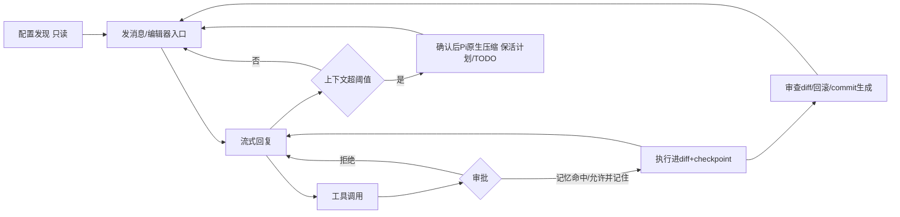
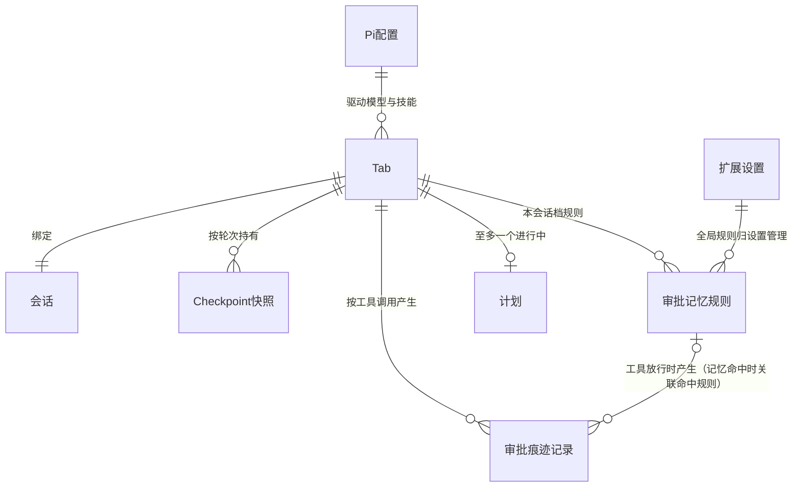
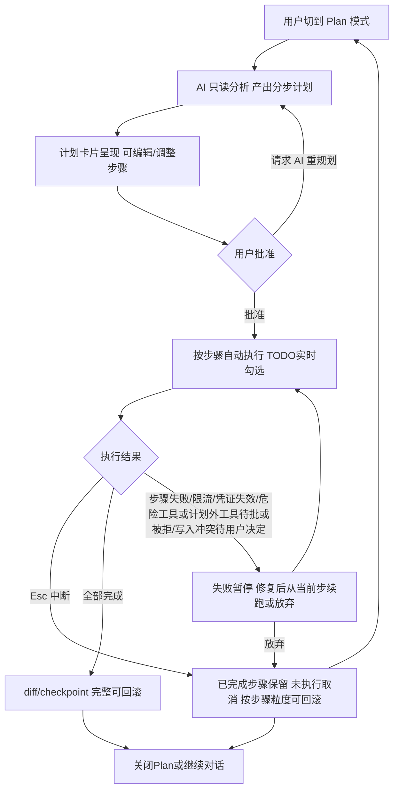
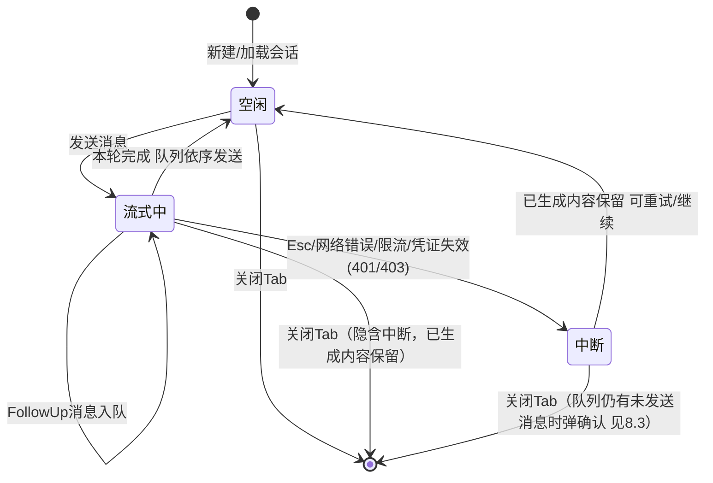
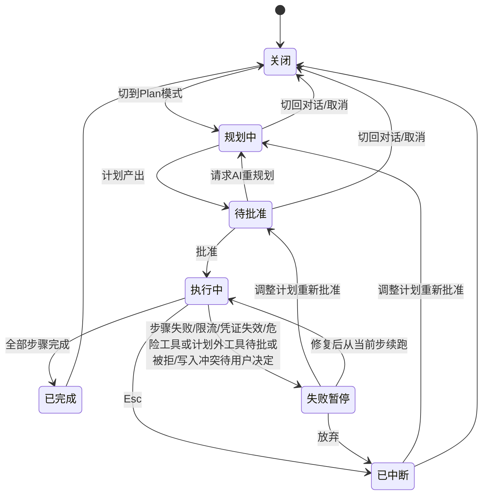
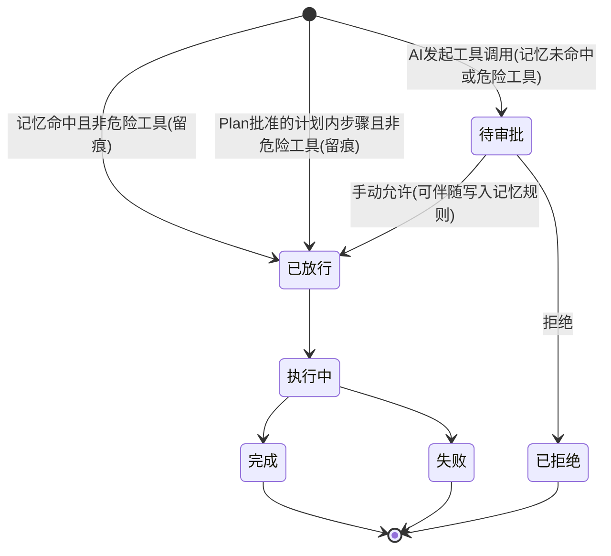
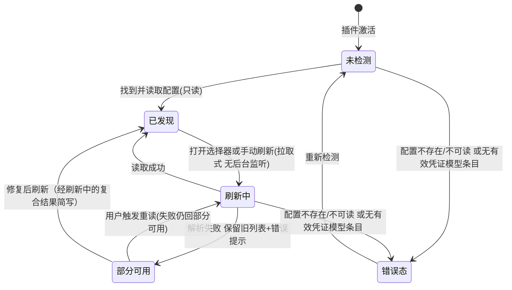

# pi-vscode 产品级完善 PRD（对标 Copilot / Claude Code · Marketplace 发布）

## 1. 文档元信息（M01）

| 项 | 值 |
|----|-----|
| 需求编号 | #0000 |
| 版本 | v1.4 |
| 状态 | 正式 |
| 作者 | Claude (sonnet-5) 与用户 grill-me 拷问收敛 |
| 场景类型 | B+C（新增功能为主，辅以既有改造；含界面/图标视觉重设计横切项） |
| 前提约束 | 目标用户已自行安装并配置好 Pi（`~/.pi/agent` 含凭证与模型配置）；插件零配置接入，只读取既有配置，不内置向导、不引导安装 |

**修订记录**

| 日期 | 变更人 | 变更内容 |
|------|--------|---------|
| 2026-09-14 | Claude (sonnet-5) | v0.1 草稿（需求概述/功能清单/业务流程三块） |
| 2026-09-14 | Claude (sonnet-5) | v1.0 正式：冻结核心闭环契约，补全 M01/M03a/M05/M08-M13/M15/M16/M03b |
| 2026-09-14 | Claude (sonnet-5) | v1.1：Phase 6 契约评审修复（5 处 P0 + 20 处 warn 全部落地），处置记录见 16.4 |
| 2026-09-14 | Claude (sonnet-5) | v1.2：Phase 6 第二轮评审修复（3 处 P0：Steer/FollowUp 发送语义消歧、Plan 危险工具被拒归宿、6.3 关闭边补齐；19 处 warn 同步落地） |
| 2026-09-14 | Claude (sonnet-5) | v1.3：Phase 6 第三轮评审修复（3 处 P0：8.4 节点 ID 撞车、8.2 中断/拒绝分支回流对齐契约出口④、错误态触发补"无有效凭证"三情形；27 处 warn 全部落地，处置记录见 16.4） |
| 2026-09-14 | Claude (sonnet-5) | v1.4：Phase 6 第四/五轮评审修复（第四轮 1 处 P0：8.5 工具状态机 Plan 批准放行边补"且非危险工具"并与 6.3/9.5 对齐；第五轮 0 P0 通过，11 处 warn 全部落地——Plan 子流程入口/出口接回主流程、编辑器入口启动时序、放弃行 checkpoint 回滚消歧、中断后直接发送收尾、关闭中断态 Tab 队列确认、11.4 上下文满行、6.1 痕迹边标签、6.3 规划中中断备注化、8.5 简写边标注；处置记录见 16.4） |

**术语定义**（派生自 `.cache/glossary.md`，覆盖全文核心业务概念）

| 术语 | 定义 |
|------|------|
| Tab（标签页） | 一个独立的 Pi 对话，拥有自己的会话、diff 跟踪与 checkpoint，状态不跨 Tab 共享 |
| Turn（轮次） | 一个 Tab 内一次"提示词-回复"循环，单调递增，checkpoint 与 diff 共用同一序号 |
| Checkpoint（检查点） | 按轮次的文件前后快照，用于回滚与重放 |
| 工具审批 | 拦截待执行的工具调用，弹出审批卡片由用户放行或拒绝 |
| 审批记忆 | 按"工具名"记住放行决定（本会话/全局两档，危险工具例外），免重复审批 |
| IDE Bridge | 本地令牌认证的 HTTP 服务，把编辑器能力（选区、诊断、符号、WorkspaceEdit 等）暴露为 Pi 工具 |
| 上下文压缩（Compaction） | 上下文接近窗口上限时的摘要压缩机制；本次改造为阈值提示、确认后走 Pi 原生压缩 |
| Steer（转向） | 流式进行中插入的中断性引导消息 |
| FollowUp（队列） | 流式进行中排队的后续消息，当前轮结束后依序发送 |
| Session（会话） | Pi 的持久化对话记录，与终端 CLI 同格式、可双向续聊 |
| Skill（技能） | Pi 的资源化提示词扩展，经 `/` 命令菜单调用 |
| Thinking Level（思考级别） | 推理深度档位：off/minimal/low/medium/high |
| SecretStorage | VS Code 提供的加密凭据存储，API key 专用，禁止明文 |
| Pi 配置发现 | 插件启动时自动读取用户已配置好的 Pi 凭证/模型/技能/会话；未检测到配置时呈现明确错误态 |
| 图片输入 | 聊天输入框粘贴/选择图片并随消息发送给模型 |
| 代码块 Apply | 把聊天回复中的代码块经 diff 预览确认后写入/插入编辑器文件 |
| Inline Chat | 编辑器内部直接呼出的对话（行内 diff、接受/放弃） |
| @-mention | 输入 @ 引用文件/符号并作为上下文注入 |
| Plan 模式 | 只读规划模式：先产出计划、批准后自动执行、Esc 可中断 |
| 界面改版 | 聊天 Webview 的整体视觉与布局重设计（含新图标），承载本批全部新交互 |

## 2. 需求概述（M02）

### 2.1 需求背景

pi-vscode 目前是一个"能用的侧边栏聊天客户端"，但交互形态停留在聊天窗口内：无编辑器内交互（Inline Chat/右键菜单）、无上下文注入（@-mention）、代码块无高亮与 Apply、工具审批逐次弹卡无记忆、流式渲染长回复卡顿、无压缩自动化，且首次打开无 Pi 配置时是空白面板。对标 Copilot / Claude Code 的差距共 14 项（见 ROADMAP.md），无法作为正式产品发布到 VS Code Marketplace。方案是保留 Pi SDK 原生 agent 运行时（会话、压缩、技能、steer/队列），在其上一次到位补齐四层能力（对话体验完整化 / 编辑器内交互 / 模式与进阶 / 产品化底座）并整体改版 UI 与图标。

### 2.2 需求价值与目标

让已配置 Pi 的开发者在 VS Code 内获得对标 Copilot/Claude Code 的完整 AI 编码体验，同时与终端 Pi 生态（会话/模型/技能/凭证）保持完全同源、零资产分裂。

可量化目标：
- 已配置 Pi 的用户从打开插件到发出第一条消息 ≤ 30 秒，零额外配置步骤
- ≥2000 token 流式回复下滚动无可感知卡顿（无整块重绘闪烁）
- 17 项核心路径功能全部可用并通过验收
- 深浅色主题 × 中/英语言四组合无破版、无英文残留（中文环境）
- Marketplace 审核通过并成功发布

### 2.3 业务场景

| 业务场景 | 一句话描述 |
|---|---|
| 首次打开零配置接入 | 已配置 Pi 的用户装完插件点开侧边栏，自动读取 `~/.pi/agent` 的凭证/模型/技能/会话，30 秒内发出第一条消息 |
| 无 Pi 配置错误态 | 未检测到 Pi 配置时面板给出明确错误态：缺失说明 + 文档链接 + "重新检测"入口，绝不空白 |
| 聊天协作修 bug 全循环 | 描述问题 → AI 调工具改文件 → 审 diff → 跑测试 → 生成 commit message，全程不离开 VS Code |
| 工具审批与记忆 | 首次弹审批卡可"允许并记住"；同类调用按工具名自动放行且有可见痕迹；危险工具永不自动放行；设置页可撤销且立即生效 |
| 上下文接近上限自动压缩 | 阈值提示条告知保留范围，确认后走 Pi 原生压缩；计划/TODO 明确保活；可拒绝继续手动 |
| 编辑器内局部重构（Inline Chat） | 选中代码呼出行内输入，行内 diff 预览，接受落盘并纳入 checkpoint 体系，放弃不落盘 |
| 上下文注入 | @文件/@符号补全、选区右键携带上下文发送、拖拽文件进对话 |
| Plan 模式大改动 | 只读规划产出计划 → 批准自动执行（TODO 实时勾选）→ Esc 随时中断 → 已完成步骤保留并可按粒度回滚 |
| 代码块 Apply 落地 | 回复代码块语法高亮；Apply 前显示目标文件与 diff 预览，确认写入且可一步撤销 |
| 图片输入 | 粘贴/按钮/拖拽发送截图；入口按当前模型能力动态启用，不支持时置灰+提示 |
| 双端续聊 | 终端 CLI 的会话在插件里接着聊；插件产出的会话终端 `pi --continue` 可继续，token/成本口径一致 |
| 多语言与主题 | 中/英界面切换、深浅色主题自适应，文案经集中层统一出口 |

### 2.4 用户角色概览

| 角色 | 定义 | 职责 | 使用频率 |
|------|------|------|---------|
| 已配置 Pi 的新装用户 | 已在终端装好并配置 Pi，首次安装本插件 | 验证配置被正确读取、发出首条消息 | 安装期集中使用 |
| 日常重度使用者 | 每天 4-8 小时在 VS Code 编码，AI 协作为主工作流 | 发起对话、审批工具调用、审 diff/计划、回滚、生成 commit | 每天全天候（一天 20+ 对话、50+ 工具调用） |
| Pi 生态存量用户 | 终端 pi CLI 重度用户，资产沉淀在 `~/.pi/agent` | 双端（终端/IDE）续聊同一会话、共用模型与技能 | 每天多端切换 20+ 次 |

### 2.5 现状-目标-差距（改造类条目）

| 改造点 | 现状 | 目标 | 差距 |
|--------|------|------|------|
| 首次打开 | 无任何凭证时是空白面板 | 明确错误态 + 文档链接 + 重新检测 | 需新增配置发现与错误态呈现 |
| 工具审批 | 每次手动点 Approve，仅全局开关 | 按工具名记忆（会话/全局）+ 危险工具例外 + 留痕 + 设置页可撤销 | 需新增记忆规则存储与管理界面 |
| 上下文压缩 | 仅手动命令触发 | 阈值提示条说明保留范围，确认后走 Pi 原生压缩 | 需新增用量监听、提示条与确认流 |
| 流式渲染 | 每 delta 全量重渲染 markdown | 增量渲染，长回复滚动不卡顿 | 需改造渲染管线为增量更新 |
| 界面 | 初版聊天布局，无统一视觉规范 | 整体重设计 + 新图标 + 中英双语 | 横切改造，承载全部新交互 |

## 3. 核心闭环契约（评审基线，已冻结）

**一句话**：已配置 Pi 的用户在 VS Code 内完成"描述任务 → Pi 流式执行 → 审批放行（按工具名记忆）→ 改动落地可回滚 → 上下文满时确认压缩 → 继续协作"的闭环，全程不离开编辑器、会话与终端 Pi 完全同源。

| 要素 | 内容 |
|------|------|
| 触发 | 已配置 Pi 的用户打开插件面板或向新/现有 Tab 发送一条消息（含编辑器入口：Inline Chat/右键/@-mention/拖拽/图片） |
| 主路径 | 激活时只读发现 `~/.pi/agent` 配置 → 渲染模型/技能/会话 → 选模型发消息 → Pi SDK 流式回复 → AI 发起工具调用 → 审批（记忆命中自动放行留痕 / 弹卡放行并按工具名记忆）→ 工具执行改动进 diff+checkpoint → 本轮完成 → 继续追问或 Plan 模式出计划批准自动执行 |
| 结果 | 不离开 VS Code 完成编码协作；改动有 diff 审查与按轮次/步骤回滚兜底；会话每轮落盘为 pi 原生格式，终端可续聊，token/成本口径一致 |
| 关键异常出口 | ① 未检测到 Pi 配置 → 明确错误态+文档链接+重新检测；② 流式中断（Esc/网络）→ 已生成内容保留，可重试/续聊；③ 压缩失败 → 保持原上下文并提示，可改用手动命令；④ 工具失败/被拒 → 结果回传 AI 继续对话，已改文件可按轮次回滚；⑤ 凭证失效 → 具体错误（如 401），修复后无需重启即可恢复 |
| 核心实体状态流转 | Tab：空闲→流式中→完成/中断→空闲；Plan：关闭→规划中→待批准→执行中→已完成/已中断；工具调用：待审批→已放行/已拒绝→执行中→完成/失败；配置发现：未检测→已发现/错误态→刷新中→部分可用→已发现（详图见 8.5） |
| 功能间映射 | 配置发现为根节点（供模型选择器/技能菜单/会话列表）；@-mention/右键/拖拽/图片为上下文输入；审批记忆作用于工具调用环节；Inline Chat/Apply/Plan 执行的改动统一进 diff+checkpoint 体系；压缩作用于会话上下文且保活计划/TODO；界面改版与 i18n 是以上全部交互的载体 |



## 4. 验收策略声明（M03a）

| 维度 | 验收方向 |
|------|---------|
| 验收方法论 | Given-When-Then 断言 + 场景法操作闭环（前置→触发→成功→失败→恢复→并发）+ 异常四维度覆盖 |
| 功能验收 | 17 项核心路径逐条对应 M03b 功能级 AC；E2E 场景与 M07 流程图一一对应 |
| 性能验收 | 流式渲染、列表加载、选择器过滤均按 M13.1 量化指标判定 |
| 兼容性验收 | VS Code 版本 × 主题 × 语言四组合遍历，无破版无残留 |
| 安全验收 | 凭证不出明文、危险工具不放行、IDE Bridge 令牌认证沿用 |
| 发布验收 | Marketplace 审核通过（图标、README、分类齐全），既有能力零回归（单元+集成测试全绿） |

## 5. 范围定义（M05）

### 5.1 In Scope（本次做什么）

| # | 范围项 | 优先级 |
|---|--------|--------|
| 1 | Pi 配置零配置接入（只读发现凭证/模型/技能/会话；无配置时明确错误态+文档指引） | P0 |
| 2 | 图片输入（入口动态启用、粘贴/按钮/拖拽） | P1 |
| 3 | 代码块语法高亮 + Apply（diff 预览、可撤销） | P0 |
| 4 | 流式渲染性能优化（增量渲染） | P0 |
| 5 | 工具审批按工具名记忆（会话/全局 + 危险工具例外 + 留痕 + 设置页管理） | P0 |
| 6 | 上下文阈值询问式自动压缩（Pi 原生机制、保活计划/TODO） | P1 |
| 7 | 选区右键菜单（携带上下文发送） | P1 |
| 8 | @-mention（文件+符号补全，无索引时降级仅文件） | P1 |
| 9 | 拖拽文件进对话 | P2 |
| 10 | 真 Inline Chat（编辑器内输入 + 行内 diff + 接受/放弃 + 冲突提示） | P0 |
| 11 | Plan 模式（只读规划 → 批准即自动执行 → Esc 中断、按步骤回滚） | P0 |
| 12 | TODO 任务进度卡片 | P1 |
| 13 | 终端集成（AI 读取/引用终端输出） | P1 |
| 14 | commit message 生成（只填入不自动提交） | P1 |
| 15 | 子代理/后台任务面板 | P2 |
| 16 | 界面与图标整体重设计（布局可重排，承载以上全部交互） | P0 |
| 17 | 界面多语言（中/英） | P1 |

### 5.2 Iteration Pool（迭代池，后续轮次）

| 项 | 推迟原因 |
|----|---------|
| @-mention 目录级批量上下文 | 文件+符号已覆盖高频场景，目录级涉及上下文体量控制策略 |
| 审批记忆按命令前缀细化 | 先验证按工具名粒度的实际打扰率 |
| Plan 模式多方案对比 | 单方案闭环先跑通 |

### 5.3 Out of Scope（明确不做）

| 项 | 原因 |
|----|------|
| 配置向导 / Pi CLI 安装引导 | 用户明确排除：默认用户已配置好 Pi，插件只读取既有配置 |
| 遥测统计与数据埋点上报 | 用户明确排除 |
| Marketplace 之外的发布渠道（OpenVSX 等） | 聚焦首发渠道 |
| 账号体系 / 设置与凭证云同步 | 单机个人工具，无此诉求 |
| Pi 后端协议本身的改造 | 只消费 SDK，不改 SDK |

## 6. 数据模型（M08）

### 6.1 实体关系



### 6.2 实体字段定义

| 实体 | 核心字段 | 说明与约束 | 来源 |
|------|---------|-----------|------|
| Pi 配置 | provider 凭证（auth.json）、模型目录（models.json：模型ID/名称/费率/上下文窗口/兼容参数）、技能目录（skills） | 插件只读，永不写入；自定义条目与内置目录按 pi 合并语义呈现 | 用户/Pi CLI |
| 会话 | 消息历史、Turn 序号、token 用量、模型信息、压缩摘要 | 每轮即时落盘，格式与终端 pi 完全一致；压缩产物为 pi 原生格式；token 用量与成本直接采用 pi 会话文件原生用量字段与 models.json 费率，扩展不自算口径 | Pi SDK |
| Tab | 绑定会话、流式状态、模式状态、diff/checkpoint 协调 | 每 Tab 隔离，状态不跨 Tab 共享 | 插件 |
| 审批记忆规则 | 工具名、范围（本会话/全局）、创建时间 | 存扩展私有存储，不写入 `~/.pi/agent`；危险工具禁止记忆；本会话档随 Tab 关闭自动清除，全局档持久保存直至撤销 | 插件 |
| 审批痕迹记录 | 工具名、放行来源（手动/记忆命中/Plan 批准）、时间、参数摘要 | 消息流中可展开查看，放行来源字段值区分（记忆/手动/Plan 批准） | 插件 |
| Checkpoint 快照 | 轮次号、步骤号（Plan 执行时）、文件路径、前后内容快照 | 按轮次/步骤可回滚；存扩展私有存储 | 插件 |
| 计划 | 步骤列表（描述/状态：待执行/执行中/已完成/失败/已取消） | 压缩时保活；执行中实时勾选 | Pi SDK 产出、插件呈现 |
| 扩展设置 | 默认模型、界面语言、审批记忆全局规则列表 | 显式标注"VS Code 侧"，与 Pi 侧配置边界清晰，不回写 Pi；思考级别等跟随 Pi SDK 原生机制（会话级），VS Code 侧不另存 | VS Code 设置/插件存储 |

### 6.3 状态枚举表

**Tab 会话状态**

| 状态 | 含义 | 触发条件 | 可流转到 |
|------|------|---------|---------|
| 空闲 | 无进行中的请求 | 新建/加载会话，或本轮完成/中断恢复 | 流式中、终（关闭） |
| 流式中 | 模型正在流式输出 | 发送消息 | 流式中（FollowUp 消息入队 状态不变）、空闲（本轮完成）、中断、终（关闭） |
| 中断 | Esc、网络错误、限流或凭证失效导致停止 | 用户按 Esc、网络异常、限流暂停、凭证失效（401/403） | 空闲（已生成内容保留）、终（关闭） |

**Plan 模式状态**

| 状态 | 含义 | 触发条件 | 可流转到 |
|------|------|---------|---------|
| 关闭 | 未启用 Plan | 默认；或已完成/已中断后关闭 | 规划中 |
| 规划中 | AI 只读分析产出计划；规划期间 Tab 侧遇 Esc/网络中断转中断态，Plan 保持规划中，重试后继续产出计划（非独立 Plan 状态流转，与 8.5 一致） | 切到 Plan 模式 | 待批准、关闭（切回对话/取消） |
| 待批准 | 计划卡片已呈现等待用户决定 | 计划产出 | 规划中（请求 AI 重规划）、执行中（批准）、关闭（切回对话/取消） |
| 执行中 | 按步骤自动执行，TODO 实时勾选 | 用户批准 | 已完成、已中断、失败暂停 |
| 失败暂停 | 执行暂停在当前步骤（步骤失败/限流/凭证失效/危险工具或计划外工具待批或被拒/写入冲突待用户决定） | 执行中遇到上述情况 | 执行中（修复后从当前步续跑）、待批准（调整计划重新批准）、已中断（放弃） |
| 已完成 | 全部步骤完成 | 最后一步执行成功 | 关闭 |
| 已中断 | Esc 停止，已完成步骤保留 | 用户按 Esc | 规划中（调整重批）、关闭 |

**工具调用状态**

| 状态 | 含义 | 触发条件 | 可流转到 |
|------|------|---------|---------|
| 待审批 | AI 发起工具调用等待决定 | 工具调用且记忆未命中或为危险工具 | 已放行、已拒绝 |
| 已放行 | 允许执行 | 手动允许（可伴随写入记忆规则）；或记忆命中且非危险工具（不经过待审批直接放行，留痕）；或 Plan 批准（计划内步骤且非危险工具，留痕；危险工具仍弹卡见 9.5） | 执行中 |
| 已拒绝 | 不执行 | 用户拒绝 | 终（结果回传 AI） |
| 执行中 | 工具正在执行 | 已放行 | 完成、失败 |
| 完成 / 失败 | 执行结束 | 成功或异常 | 终（结果回传 AI） |

**配置发现状态**

| 状态 | 含义 | 触发条件 | 可流转到 |
|------|------|---------|---------|
| 未检测 | 插件激活后初始 | 插件激活 | 已发现、错误态 |
| 已发现 | 配置读取成功，UI 呈现 | 找到并读取配置 | 刷新中 |
| 错误态 | 配置不存在、不可读或无有效凭证/模型条目 | `~/.pi/agent` 不存在、权限不足/被占用不可读，或存在但无有效凭证/模型条目（"无有效凭证"=无凭证条目或条目不可解析，属发现期结构性判断；凭证过期属运行期 provider 拒绝，归 11.3 逐 provider 标注处置，不触发配置发现错误态） | 未检测（重新检测） |
| 刷新中 | 正在重读配置 | 打开模型选择器或手动刷新（拉取式，无后台监听） | 已发现、部分可用、错误态（配置不存在/不可读或无有效凭证/模型条目） |
| 部分可用 | 解析失败但保留旧列表 | 配置文件语法错误等 | 刷新中（用户触发重读，失败仍回部分可用）、已发现（修复后刷新成功） |

## 7. 功能清单（M06）

| 模块 | 界面 | 按钮/操作 | 核心功能点 | 状态(新增/修改/复用) | 优先级 |
|---|---|---|---|---|---|
| 配置接入 | 侧边栏主面板 | 重新检测 | 启动自动读取 `~/.pi/agent` 凭证/模型/技能/会话（只读）；显示"已读取 N provider / M 模型"；外部配置变更后打开选择器即刷新；未检测到时明确错误态+文档链接 | 新增 | P0 |
| 配置接入 | 聊天输入区 | `/` 技能菜单 | 列出配置发现读取的 Pi 技能并可调用，清单与终端一致；技能目录变更随配置热刷新更新 | 复用 | P1 |
| 会话管理 | 侧边栏主面板 | 新建 Tab | 新建对话标签页（既有能力，契约触发"向新 Tab 发送消息"的落点） | 复用 | P0 |
| 对话体验 | 聊天输入区 | 图片按钮/粘贴/拖拽图片 | 随消息发送图片；入口按当前模型能力动态启用，不支持时置灰+提示 | 新增 | P1 |
| 对话体验 | 聊天消息流 | Apply / 复制 | 代码块语法高亮；Apply 弹目标文件+diff 预览，确认写入且可一步撤销 | 新增 | P0 |
| 对话体验 | 聊天消息流 | — | 流式增量渲染，长回复滚动不卡顿、增量不重渲染整块 markdown | 修改 | P0 |
| 对话体验 | 审批卡片 / 设置页 | 允许并记住 / 管理规则 | 按工具名记忆放行（本会话/全局两档）；危险工具永不自动放行；自动放行留痕；设置页查看/撤销即时生效 | 新增 | P0 |
| 对话体验 | 输入区上方提示条 | 压缩 / 暂不 | 上下文超阈值提示并说明保留范围，确认后走 Pi 原生压缩，计划/TODO 保活；保留手动压缩命令 | 新增 | P1 |
| 对话体验 | 输入区 / 模型选择器 | Steer / 思考级别 | 流式中普通发送默认入 FollowUp 队列（本轮结束后依序发送）；Steer 为显式动作（输入区按钮/快捷键）立即注入当前轮；思考级别（Thinking Level）随模型选择器设置 | 复用 | P1 |
| 对话体验 | 消息流 / 中断恢复区 | 队列消息确认 | 中断恢复后队列消息保留可见，提供逐条发送与一键清空入口，不自动发送也不静默丢弃 | 新增 | P1 |
| 对话体验 | 消息流 / 中断恢复区 | 重试 | 中断/失败后错误条提供重试入口：网络失败/限流重试续跑补全本轮；401/403 修复凭证后点重试恢复；与队列确认入口同区 | 新增 | P1 |
| 编辑器交互 | 编辑器右键菜单 | 发送到 Pi | 选区代码携带上下文发送到当前/新 Tab | 新增 | P1 |
| 编辑器交互 | 聊天输入区 | @ 补全 | @-mention 文件+符号模糊补全并注入上下文；无符号索引时降级仅文件 | 新增 | P1 |
| 编辑器交互 | 聊天输入区 | 拖放 | 拖拽文件进对话转为引用 | 新增 | P2 |
| 编辑器交互 | 编辑器内浮层 | 接受 / 放弃 / 追加指令 | 真 Inline Chat：编辑器内输入、行内 diff 预览、接受落盘纳入 checkpoint、放弃不落盘、未保存手改冲突提示 | 新增 | P0 |
| 模式与进阶 | 模式切换器 / TODO 卡片 | 切换模式 / 批准执行 / Esc 中断 | Plan 模式：只读规划 → 计划卡片（可改）→ 批准自动执行 → Esc 中断保留已完成步骤 | 新增 | P0 |
| 模式与进阶 | 聊天消息流 | — | TODO 任务进度卡片，执行中实时勾选、失败项标注 | 新增 | P1 |
| 模式与进阶 | 集成终端 | — | 终端集成：AI 可读取/引用终端输出 | 新增 | P1 |
| 模式与进阶 | SCM 面板 | 生成 commit message | 基于当前 diff 生成 message 填入 SCM 输入框，只填入不自动提交 | 新增 | P1 |
| 模式与进阶 | 后台任务面板 | 查看 / 取消 | 子代理/后台任务状态可见、可管理 | 新增 | P2 |
| 产品化底座 | 全部 UI + 扩展图标 | — | 界面与图标整体重设计（布局可重排、新图标含 marketplace 资产），承载以上全部新交互 | 修改 | P0 |
| 产品化底座 | 全部 UI | — | 界面多语言（中/英），文案集中层唯一出口，深浅主题 CSS 变量适配 | 修改 | P1 |

## 8. 业务流程（M07）

### 8.1 泳道图

```mermaid
flowchart LR
    subgraph U[用户]
        U1[输入消息/审批/接受diff]
    end
    subgraph ED[编辑器端]
        E1[Inline Chat/右键菜单/@mention]
        E2[行内diff/Apply写入]
    end
    subgraph WV[Webview 聊天UI]
        W1[消息流/审批卡/TODO卡/压缩提示条]
        W2[模型选择器/会话历史/技能菜单]
    end
    subgraph EH[扩展宿主]
        H1[TabManager 会话循环]
        H2[审批记忆/Checkpoint]
    end
    subgraph SDK[Pi SDK]
        P1[模型调用/工具执行/原生压缩]
    end
    subgraph PI[(~/.pi/agent 只读)]
    end
    U1 --> W1
    U1 --> E1
    E1 --> H1
    W1 -->|ClientMessage| H1
    H1 --> P1
    P1 -->|流式事件| H1
    H1 -->|ServerMessage| W1
    H1 --> H2
    H1 --> E2
    P1 -->|每轮落盘| PI
    EH -->|启动时只读| PI
```

### 8.2 主流程图

```mermaid
flowchart TD
    A[用户打开插件] --> B{检测 Pi 配置}
    B -->|未检测到| C[错误态: 缺失说明+文档链接+重新检测]
    C -->|修复后重新检测| B
    B -->|检测到| D[只读读取 凭证/模型/技能/会话]
    D --> E[渲染主面板 显示已读取统计]
    E --> F[选模型 发送消息]
    ED[编辑器入口 Inline Chat/右键菜单 见9.4] -.-> F
    F --> G[流式回复渲染]
    G --> H{AI 发起工具调用}
    H -->|否| I[本轮完成 回复呈现]
    H -->|是| J{审批记忆命中}
    J -->|命中且非危险工具| K[自动放行 留痕记录]
    J -->|未命中| L[弹审批卡片]
    L -->|允许一次| O
    L -->|拒绝| N[不执行 AI收到拒绝 继续对话]
    L -->|允许并记住| M[写入记忆规则 会话/全局]
    M --> K
    K --> O[工具执行 改动进diff+checkpoint]
    O -->|执行失败| N2[结果回传AI 已改文件可按轮次回滚]
    N2 --> G
    O -->|成功| G
    O -->|用户审查| I2[审查diff/按轮次回滚/commit生成]
    I2 --> F
    N --> G
    I -.->|切到 Plan 模式| PLAN[Plan模式子流程 见 8.4]
    F -.->|空闲态切到 Plan 后发消息 不限于本轮完成后| PLAN
    I --> P{上下文超阈值}
    P -->|否| F
    P -->|是| Q[提示条: 说明保留范围]
    Q -->|确认| R[Pi原生压缩 计划/TODO保活]
    Q -->|暂不| F
    R --> F
    R -->|压缩失败: 保持原上下文并提示(11.4)| F
    G -->|流式中再发送: 入队 本轮完成后依序发送 见8.5| G
    G -->|Esc/网络错误/限流/凭证失效(401/403)| S[中断: 已生成内容保留]
    S --> F
    S -->|重试续跑补全本轮| G
```

### 8.3 主流程节点说明表

| 节点 | 业务规则 |
|------|---------|
| 检测 Pi 配置 | 只读扫描 `~/.pi/agent`（凭证/模型/技能/会话），插件全生命周期不写入、不迁移、不"规范化" |
| 只读读取 | 解析失败保留上一个可用列表并给出文件+行号级错误；多 provider 部分失效仅标注失效项，不整体失败 |
| 渲染主面板 | 显示"已从 Pi 读取 N provider / M 模型 / K 技能"统计；模型列表与终端 `/model` 一致（含自定义条目）；技能菜单清单与终端一致 |
| 发送消息 | 会话每轮即时落盘为 pi 原生格式，Turn 序号延续 |
| 审批记忆命中 | 危险工具（如任意 shell 执行）一律不命中记忆；自动放行在消息流留可展开痕迹 |
| 工具执行 | 改动进入 diff 记录与按轮次 checkpoint，供审查与回滚；消息流提供改动清单入口，支持打开 diff 与按轮次回滚 |
| 上下文压缩 | 走 Pi 原生机制；提示条说明保留范围且计划/TODO 明确保活；未发送队列消息列入保留清单，压缩后依序发送语义不变；拒绝后同一阈值区间不重复提示 |
| 中断 | 已生成内容保留展示，并按 pi 原生格式落盘为不完整轮次（重试=续跑补全本轮，会话文件不留损坏记录；"重发"仅指对已完成轮次重新发送新消息）；未发送的队列消息保留，恢复后由用户确认逐条发送或一键清空；可重试续跑；中断后直接发送新消息=放弃补全，原轮次按中断态定格保留，新消息开启新 Turn；普通关闭重开 Tab 后对不完整轮次同样提供续跑补全入口；关闭处于中断态的 Tab 且队列仍有未发送消息时弹确认，不静默丢弃 |

### 8.4 子流程图：Plan 模式



> S10 出口说明：「关闭 Plan」= Plan 终止（归宿见 8.5 Plan 状态机）；「继续对话」= 回到 8.2 主流程 F 节点继续发送消息，子流程出口接回主路径循环。

### 8.5 状态机

**Tab 会话状态机**



**Plan 模式状态机**



> Tab 关闭时 Plan 归宿：规划中/待批准直接终止；执行中/失败暂停视同中断（已完成步骤保留，对应 8.5 Tab 状态机关闭边）。

**工具调用审批状态机**



**配置发现状态机**



## 9. 功能详细说明（M09）

> 每个界面的操作均按场景法闭环定义；异常详情统一见 M11。字段定义引用 M08 数据模型。

### 9.1 侧边栏主面板（配置接入 + 会话入口）[新增]

| 控件/操作 | 业务规则 |
|----------|---------|
| 启动发现 | 激活时只读读取 `~/.pi/agent`：凭证（auth.json）、模型（models.json，含自定义条目按 pi 合并语义）、技能、历史会话；显示"已从 Pi 读取 N provider / M 模型"统计 |
| 重新检测按钮 | 错误态下可用；点击后重走发现流程，成功即渲染主面板，无需重启 VS Code（输入草稿保留） |
| 错误态呈现 | 未检测到配置时：缺失说明 + 文档链接 + 重新检测按钮；不出现空白面板、不出现配置表单 |
| 环境变量凭证提示 | 当终端可发现 pi 而当前 VS Code 进程读不到同等凭证时，提示具体原因（凭证依赖的环境变量在当前进程不可见） |
| 会话历史入口 | 列出 pi 会话目录中的会话（按项目/时间），可搜索；加载 CLI 会话后上下文、token 用量与终端一致（如终端显示 87K 则插件同为 87K） |
| 技能菜单（`/` 命令）[复用] | 菜单列出配置发现读取的技能并可调用，与终端一致；技能目录变更随热刷新更新；单个技能文件损坏仅跳过并提示，不影响其余技能加载 |
| 新建 Tab [复用] | 新建对话标签页，作为"向新 Tab 发送消息"的入口落点 |
| 配置热刷新 | 打开模型选择器或手动刷新时重读配置；外部改配置无需重启 VS Code；进行中会话的模型被删除时提示换模型 |

### 9.2 聊天输入区（图片 / @-mention / 拖拽 / 模式切换）[新增]

> 消息入口分两类：编辑器侧（Inline Chat、右键菜单）与输入区侧（@-mention、拖拽、图片），均为契约触发行声明的消息入口。

| 控件/操作 | 业务规则 |
|----------|---------|
| 图片输入 | 入口按当前模型能力动态启用；支持粘贴、按钮选择、拖拽图片；模型不支持时入口置灰，点击与粘贴均有明确提示，不无声失败；图片随消息落盘为 pi 会话格式 |
| @-mention | 输入 @ 唤起补全：文件 + 符号模糊匹配；选中后作为上下文注入；工作区无符号索引时降级仅文件级；引用的文件在发送前被删除时提示 |
| 拖拽文件 | 拖入对话转为文件引用（同 @-mention 注入路径） |
| 模式切换器 | 对话 / Plan 两档切换；切到 Plan 后输入区标注当前模式 |
| 压缩提示条 | 上下文用量超阈值（默认 80%）时出现：说明摘要将覆盖范围、计划/TODO 与 FollowUp 队列未发送消息列入保留清单（压缩后依序发送语义不变）；"压缩"按钮执行 Pi 原生压缩；"暂不"关闭提示且同一阈值区间不重复弹出，用量达到 90% 时重新提示；保留手动 `/compact` 命令 |

### 9.3 聊天消息流（代码块 / 审批 / TODO）[新增+修改]

| 控件/操作 | 业务规则 |
|----------|---------|
| 代码块渲染 [修改] | 语法高亮（按语言）；长代码块可折叠；渲染为增量更新（见 M13.1） |
| Apply 按钮 [新增] | 点击后先选目标文件并显示将替换的 diff 预览；确认后写入；写入后可一步撤销（纳入本 Tab checkpoint）；目标文件在预览与确认之间被外部修改时提示冲突 |
| 复制按钮 [复用] | 复制代码块原文 |
| 审批卡片 [修改] | 展示工具名、参数摘要、危险标识；操作：允许一次 / 允许并记住（本会话或全局）/ 拒绝；拒绝后结果回传 AI 继续对话 |
| 审批记忆命中 [新增] | 记忆命中且非危险工具时自动放行：消息流中产生可展开的痕迹条目（放行来源=记忆），与手动批准视觉可区分 |
| 危险工具例外 [新增] | 危险工具（任意 shell 命令执行等）永不自动放行，也禁止被"允许并记住" |
| 改动审查入口 [复用] | Changed Files 区按轮次列出文件变更清单，支持打开 diff 与按轮次回滚；与 checkpoint 体系同源 |
| 中断恢复入口 [新增] | 错误条/中断恢复区提供"重试"入口：网络失败/限流重试续跑补全本轮；401/403 修复凭证后点重试恢复（11.2/11.3）；Esc 中断同样在本轮消息尾部/中断恢复区提供"续跑补全本轮"入口；队列消息确认入口同区 |
| TODO 任务卡片 [新增] | Plan 执行中实时勾选步骤；失败项标注；压缩后卡片与计划本体仍可见 |

### 9.4 编辑器内交互（Inline Chat / 右键菜单）[新增]

| 控件/操作 | 业务规则 |
|----------|---------|
| Inline Chat 呼出 | 编辑器内选中代码后快捷键呼出行内输入框；指令携带选区上下文 |
| 行内 diff 预览 | 生成结果以行内 diff 呈现（未落盘）；diff 过大时可折叠/跳转，不阻塞编辑器导航 |
| 接受 | 文件更新并纳入本 Tab 的 diff/checkpoint 体系（可回滚）；存在未保存手改时先提示冲突，不静默混合 |
| 会话归属 | Inline Chat 的对话轮次与改动归属当前活跃 Tab（无活跃 Tab 时新建），Turn 序号计入该 Tab 会话并按 pi 原生格式落盘 |
| 中间工具调用 | Inline Chat 会话轮次归属 Tab 后沿用该 Tab 审批体系：生成过程中的中间工具调用（读文件/搜索/写文件等）按 9.3 审批记忆与危险工具规则处理 |
| 放弃 | 未落盘的生成结果仅作废不写入；多轮追加修改后一次放弃回到最初状态（本轮内已经由中间工具调用写入的文件改动，按该 Tab 本轮 checkpoint 自动回滚到轮前状态，与 diff/checkpoint 体系同源） |
| 选区右键菜单 | "发送到 Pi"：选区代码 + 文件路径 + 行号发送到当前 Tab（无 Tab 时新建；目标 Tab 流式中时按普通发送入 FollowUp 队列，与输入区行为一致） |
| 生成期间冲突 | 生成中用户又编辑同文件：基于旧快照的结果应用前提示"文件已变化"，由用户决定 |
| 生成中断 | 生成中 Esc/网络中断时行内呈现错误、选区与文件保持原状（未落盘的生成结果不写入），可立即重发；行内错误条提供"查看已生成结果"（pending diff 置灰呈现），可查看后选择重发或丢弃；凭证失效（401/403）同走 Tab 中断语义，行内呈现具体错误，修复凭证后可重发；Tab 会话状态沿用 6.3 中断语义 |

### 9.5 Plan 模式执行 [新增]

| 控件/操作 | 业务规则 |
|----------|---------|
| 只读边界 | 规划中仅允许只读工具（读文件/搜索等）；任何写类工具调用被拒绝 |
| 计划卡片 | 分步 TODO 结构化呈现；本地微调（调整顺序/删减步骤）停留待批准可直接批准；请求 AI 重规划则退回规划中重新产出 |
| 自动执行 | 批准后按步骤连续执行，TODO 实时勾选；期间 Esc 立即停止当前与后续步骤；计划批准视为该计划内步骤非危险工具调用的放行凭据（放行来源=Plan 批准，消息流留痕），不逐次弹审批；危险工具例外：仍弹卡并暂停当前步骤（失败暂停态），批准后从当前步继续（留痕放行来源=手动）；用户拒绝时该步骤标记失败维持失败暂停，可调整计划重新批准或放弃（已中断）；写入前检测目标文件变化（11.2 写冲突规则），命中时暂停等待用户决定（失败暂停态）；执行中上下文超阈值时压缩提示条照常出现，确认后压缩、执行继续，压缩失败按 11.4 处理不触发失败暂停 |
| 计划外工具调用 | Plan 执行中 AI 发起计划外、非危险且记忆未命中的调用视同普通调用走 9.3 审批记忆体系（弹卡期间该步骤暂停）；放行后继续执行，拒绝时按危险工具例外同路径维持失败暂停 |
| 中断后状态 | 已完成步骤的改动保留且界限清晰（按步骤/轮次可查变更清单）；未执行步骤标记取消；可调整计划重新批准 |
| 回滚粒度 | 支持按步骤/轮次粒度回滚，不影响其他轮次的 redo 链 |
| Tab 状态外显 | 每个常驻状态图标：流式中 / Plan 执行中 / 失败暂停，与 6.3 枚举及 8.5 状态机一一对应；后台 Tab 失败时通知 |

### 9.6 设置页（审批记忆管理 / 语言 / 偏好）[新增+修改]

| 控件/操作 | 业务规则 |
|----------|---------|
| 审批记忆规则列表 | 展示全部规则（工具名、范围、创建时间），并标注归属（全局/某会话）；可逐条撤销，撤销立即对所有 Tab 生效（下一次同类调用重新弹审批）；支持一键清空；本会话档随 Tab 关闭自动清除 |
| 数据边界说明 | 页面标注：审批记忆/checkpoint 等扩展私有数据存于扩展自有存储，不写入 `~/.pi/agent`，终端 pi 不受影响 |
| 语言切换 | 中/英切换即时生效；全部文案（含动态拼接与变量替换）经文案集中层统一出口 |
| 默认模型 | VS Code 侧设置，显式标注归属；与 Pi 侧偏好不一致时可解释；永不回写 Pi 配置 |

### 9.7 SCM 集成（commit 生成）[新增]

| 控件/操作 | 业务规则 |
|----------|---------|
| 生成按钮 | 位于 SCM 输入框旁；基于当前暂存/未暂存 diff 生成 message 并填入输入框 |
| 边界 | 只填入不自动提交；用户可编辑后自行提交；可重新生成 |

### 9.8 终端集成与后台任务面板 [新增]

| 控件/操作 | 业务规则 |
|----------|---------|
| 终端集成 | AI 可读取/引用集成终端输出；用户也可复制终端内容粘贴进对话 |
| 后台任务面板 | 子代理/后台任务列表：状态（运行中/完成/失败）、可取消；Tab 标题常驻状态图标，后台失败发通知；后台任务由 Pi SDK 原生子代理产生，扩展经 SDK 事件呈现，不做本地建模 |
| 单写者语义 | 同一会话被第二个窗口加载时提示"已在其他窗口打开"，强制只读或接管二选一；只读 Tab 输入区置灰并显示占用提示，接管后恢复可写（呈现层标记，不新增状态机状态）；占用解除后占用提示更新并提供"恢复可写"操作，只读态提示区提供"接管"动作（复用接管语义） |

## 10. 关联与影响（M10）

| 关联系统/模块 | 关系 | 本次改动类型 | 联动方式 |
|--------------|------|------------|---------|
| Pi SDK（@earendil-works/pi-coding-agent） | 核心运行时依赖 | 复用 + 扩展层包装（Plan 只读白名单、压缩确认流） | `loadPiSdk()` 唯一网关 + feature-detect + API 审计脚本（AGENTS.md 兼容协议） |
| IDE Bridge（本地 RPC 服务） | 编辑器能力层 | 复用 + 新增消费方（Inline Chat/@-mention/右键/Apply） | 27 个 RPC 工具 + 6 类事件推送，令牌认证沿用 |
| VS Code API | 宿主环境 | 新增贡献点（右键菜单、快捷键、Inline Chat provider、SCM 按钮） | package.json contributes 声明 |
| 终端 pi CLI | 数据同源方 | 无改动（只读其配置、共用会话目录） | 文件级：会话格式 pi 原生兼容，双向续聊 |
| SecretStorage | 凭证存储 | 复用，无改动 | API key 专用加密存储 |
| Webview 渲染层 | 前端载体 | 修改（改版 + 增量渲染 + i18n） | `src/shared/protocol.ts` 消息协议扩展（新增消息类型向后兼容） |

## 11. 异常与边界（M11）

### 11.1 数据异常

| 触发条件 | 系统行为 | 提示文案（示例） | 恢复方式 |
|---------|---------|----------------|---------|
| models.json 语法/字段类型错误 | 保留上一个可用模型列表（首次启动无旧列表时呈现空列表+解析错误，归入配置发现错误态语义），面板不崩溃 | "配置文件解析失败：models.json 第 X 行（字段 cost 应为数字）" | 修复文件后打开选择器自动恢复 |
| 自定义模型条目与内置 ID 冲突 | 按 pi 合并语义只呈现一条（自定义覆盖内置） | 无（正确行为） | — |
| 模型费率元数据缺失 | 成本显示"未知费率"，不显示 0 | "该模型未配置费率" | 用户在 models.json 补充 |
| 会话文件损坏/截断（同步盘冲突） | 跳过或部分加载该会话，不拖垮历史列表 | "会话文件损坏，已跳过：xxx" | 修复文件或放弃该会话 |
| 历史会话使用的模型已下架/改名 | 明确提示并要求选替代模型，不拒载整条会话 | "此会话使用的模型不可用，请选择替代模型" | 重选模型后继续 |
| 会话文件被外部删除/移动 | Tab 呈现"会话不存在"错误态（呈现层标记，不新增状态机状态），阻止继续写入 | "会话不存在，可能已被移动或删除" | 引导新建会话 |

### 11.2 操作异常

| 触发条件 | 系统行为 | 提示文案（示例） | 恢复方式 |
|---------|---------|----------------|---------|
| 流式中按 Esc / 快速连续 Esc | 立即中断，已生成内容保留，状态机不卡死 | 无（中断即反馈） | 重试=续跑补全本轮；继续追问=对已完成轮次发送新消息 |
| 网络反复断续 | 同一请求自动重试上限 3 次，防重试风暴；队列消息不重复发送 | "网络异常，已重试 3 次仍失败，内容已保留" | 重试续跑补全本轮（不完整轮次续写同轮，不重复入历史） |
| 工具执行挂起（如测试命令不退出） | 用户 Esc 中断；已完成部分保留且可单独撤销 | 无（Esc 即中断） | checkpoint 回到执行前 |
| 5 秒内重复点击 Apply/发送 | 防抖：按钮置灰 | 无（静默防抖） | 恢复后可再点 |
| Apply 预览与确认之间文件被外部修改 | 阻止写入并提示 | "文件已被外部修改，请重新预览" | 重新预览 diff |
| AI 工具写入与用户同期手改同文件 | 写入前检测目标文件变化（未保存手改/外部修改），命中则提示冲突由用户决定；多 Tab 并行写同文件时先行警告 | "文件在你编辑期间被修改，是否仍要写入？" | 保留双方内容由用户决定，不静默覆盖 |
| 误加载旧会话并发消息 | 追加前明确警告 | "将追加到历史会话（该会话终端侧同样可见）" | 确认继续或改为新建会话 |

### 11.3 权限异常

| 触发条件 | 系统行为 | 提示文案（示例） | 恢复方式 |
|---------|---------|----------------|---------|
| provider 凭证被拒（401/403） | 区分于网络错误，流式内容保留；Plan 执行中则暂停在当前步（失败暂停态） | "凭证被拒绝（401），请在终端更新 Pi 凭证" | 修复后点重试，无需重启；Plan 执行中修复后从失败步骤续跑，不把失败当完成 |
| 配置发现阶段凭证无效（auth.json 存在但 key 过期） | 面板可用，该 provider 的模型条目标注"不可用"（置灰+失效标识），不从列表消失 | "provider 凭证无效，请在终端更新 Pi 凭证" | 更新凭证后重新打开模型选择器，该条目恢复可用 |
| `~/.pi/agent` 目录权限不足/被锁定 | 报"配置读取失败"而非"未安装" | "无法读取 Pi 配置（权限不足或被占用）" | 解除占用/授权后重新检测 |
| 文件编辑被拒（AI 改第 N 个文件被权限拒绝） | 前 N-1 个保留，明确清单标出失败点，不全部回滚 | "第 X 个文件修改被拒绝，其余已完成" | 授权后从失败点继续 |
| 会话文件正被终端 CLI 写入 | 以只读方式加载或提示占用 | "该会话正在其他地方使用，已只读打开" | 关闭一侧后接管 |

### 11.4 环境异常

| 触发条件 | 系统行为 | 提示文案（示例） | 恢复方式 |
|---------|---------|----------------|---------|
| GUI 启动的 VS Code 缺少 shell 环境变量凭证 | 给出具体原因而非笼统"无可用模型" | "凭证依赖的环境变量在当前 VS Code 进程不可见（桌面启动不继承 shell 变量）" | 将 key 落到 auth.json 或调整启动方式 |
| `~/.pi/agent` 位于同步盘/中文/空格路径 | 正常读取；读取瞬间竞态不崩溃不写坏 | 失败时报"配置读取失败" | 重试 |
| provider 连续限流 | 自动重试数次后暂停在当前步（Plan 执行不把失败当完成） | "请求被限流，已暂停，可稍后继续" | 稍后重试/换模型 |
| 压缩请求本身失败（provider 报错） | 保持原上下文不变，执行不无声中断；Plan 执行中压缩失败不触发失败暂停，执行继续 | "压缩失败，已保留完整上下文" | 手动 `/compact` 或结束后再试；提示条在仍超阈值时重新出现 |
| 上下文达窗口上限（用户已拒绝压缩）且请求被 provider 拒绝 | 明确提示"上下文已满，无法继续发送"，不呈现无引导的 provider 报错 | "上下文已满，无法继续发送" | 引导手动 `/compact` 或新建会话；与 9.2 提示条联动 |
| VS Code 进程崩溃/重启 | 会话数据已每轮即时落盘不丢失；重启后重载上次会话并重建 Tab | 无（恢复即为反馈） | 未完成轮次按 8.3 中断语义提供"续跑补全本轮"入口 |
| 历史会话 200+ / 单会话 500+ 消息 / 100+ 模型 | 列表可搜索、分页或虚拟化，符合 M13.1 指标 | 无（性能达标） | — |

### 11.5 防错机制

| 机制 | 规则 |
|------|------|
| 危险工具拦截 | 危险工具永不进入审批记忆；即使存在同类规则仍弹卡 |
| 插件只读纪律 | 插件全生命周期（含崩溃、升级、多窗口）不写 `~/.pi/agent` 核心文件 |
| 私有数据隔离 | 审批记忆/checkpoint 存扩展自有存储；设置页标注存放位置并支持一键导出/清空 |
| 单写者语义 | 同一会话双端/双窗口写入时强制只读或接管 |
| 每轮即时落盘 | 会话每轮立即写盘，无写缓冲延迟，防交替写入覆盖 |

## 12. 权限与敏感信息（M12）

### 12.1 功能权限矩阵

> 本插件为单用户本机扩展，唯一角色为本机开发者（VS Code 启动用户），无多角色体系。

| 功能 | 查看 | 执行 | 配置 | 撤销 |
|------|------|------|------|------|
| 聊天对话 / 流式回复 | ✅ | ✅ | — | — |
| 工具调用审批 | ✅ 痕迹 | ✅ 放行/拒绝 | ✅ 记忆规则 | ✅ 规则即时撤销 |
| diff 审查 / checkpoint 回滚 | ✅ | ✅ | — | ✅ |
| Plan 模式 | ✅ | ✅ 批准/中断 | — | — |
| Pi 配置（凭证/模型） | ✅ 只读 | ❌ 不适用（插件不写） | ❌ 不适用（归终端 pi 管理） | ❌ 不适用 |
| 审批记忆 / checkpoint 私有数据 | ✅ | — | ✅ 导出/清空 | ✅ |
| 语言 / 默认模型偏好 | ✅ | — | ✅ | — |

### 12.2 敏感信息处理

**结论**：不涉及个人敏感信息（手机号/邮箱/身份证号等）。涉及 provider API 凭证，处理如下：

| 敏感信息 | 所在位置 | 访问方式 | 保护措施 | 残留风险 |
|---------|---------|---------|---------|---------|
| provider API key | `~/.pi/agent/auth.json`（Pi 侧）与 VS Code SecretStorage（扩展侧） | 插件只读 Pi 侧，扩展侧经 SecretStorage API 读写 | SecretStorage 加密存储；不落明文设置、不写日志、不上报（遥测已排除）；沿用 Pi 既有凭证机制，本次不新增凭证处理方式 | 凭证泄露可被盗用——属 Pi 侧既有机制边界，插件不复制、不传输凭证 |

## 13. 非功能需求（M13）

### 13.1 性能

| 指标 | 目标值 |
|------|--------|
| 插件激活耗时（activation） | ≤ 1.5 秒（首次打开面板无阻塞感） |
| 流式渲染 | 每个 delta 仅更新受影响 DOM 块；≥2000 token 回复滚动无可感知卡顿（目标 60fps），无整块重绘闪烁 |
| 会话列表 | 500 条会话首屏加载 ≤ 1 秒（虚拟化/分页），搜索过滤即时 |
| 模型选择器 | 100+ 模型条目过滤 ≤ 100 毫秒，渲染不卡顿 |
| 历史会话加载 | 单会话 500+ 消息加载 ≤ 2 秒，流式状态正确还原 |
| 快速连续操作 | 中断→立即再发→再中断的状态机无死锁 |

### 13.2 安全

| 项 | 要求 |
|----|------|
| 凭证 | API key 仅存 `~/.pi/agent`（Pi 侧）与 SecretStorage，禁止明文设置/日志/上报 |
| 危险工具 | 任意 shell 执行等危险工具永不自动放行、禁止记忆 |
| IDE Bridge | 本地令牌认证沿用，不扩大监听范围 |
| Webview | 沿用既有 CSP 沙箱策略，新增功能不降低限制 |
| 只读纪律 | 对 `~/.pi/agent` 全生命周期只读（见 11.5） |

### 13.3 兼容性

| 项 | 要求 |
|----|------|
| VS Code 版本 | ≥ 1.100 |
| 平台 | Windows / macOS / Linux 桌面版（发布渠道仅 Marketplace） |
| 主题 | 深浅色跟随 CSS 变量，四组合（主题×语言）无破版 |
| Pi SDK | 遵守 AGENTS.md 兼容协议：唯一网关 + feature-detect；SDK 版本差异面向用户提示为人话 |

### 13.4 可用性

| 项 | 要求 |
|----|------|
| 键盘可达 | 发送、审批（通过/拒绝）、接受/放弃 diff、切 Tab、切模型、会话切换、聚焦输入框全部有快捷键，主操作有键位提示；键位可在 VS Code 键位设置自定义 |
| 错误文案 | 面向用户文案全部人话（不出现 SDK/API 术语堆砌），含影响说明与建议动作 |
| i18n | 中/英全覆盖含动态拼接；文案集中层为唯一出口 |

### 13.5 数据迁移（老用户升级）

| 项 | 规则 |
|----|------|
| 迁移规则 | 既有扩展设置键全部保留；审批记忆为新存储，初始化为空；既有会话/checkpoint 数据格式兼容不迁移内容 |
| 回滚策略 | 新版本异常时可回退安装旧版本：私有数据向后兼容或明确迁移提示，不允许静默失效；会话数据为 pi 原生格式天然可回退 |

## 14. 验收标准详细（M03b）

> AC-FN = 功能级，AC-OP = 操作/非功能级；E2E 场景与 M07 流程一一对应。

| 编号 | Given（前置条件） | When（操作） | Then（预期结果） | 来源 |
|------|------------------|-------------|-----------------|------|
| AC-FN-01 | `~/.pi/agent` 含有效配置（≥1 provider 凭证与模型条目，含自定义模型） | 打开插件面板 | 显示"已从 Pi 读取 N provider / M 模型 / K 技能"统计；模型列表与终端 `/model` 一致（含自定义条目）；全程零配置操作，≤30 秒可发出首条消息 | 9.1 |
| AC-FN-02 | `~/.pi/agent` 目录不存在、不可读，或存在但无有效凭证/模型条目 | 打开插件面板 | 呈现明确错误态：缺失说明（区分不存在/不可读与无有效凭证）+文档链接+重新检测按钮；无空白面板、无配置表单、无崩溃 | 9.1 |
| AC-FN-03 | 面板处于错误态，用户已在终端完成 Pi 配置 | 点击"重新检测" | 面板转入已发现态并渲染模型列表；无需重启 VS Code，输入草稿保留 | 9.1 |
| AC-FN-04 | 会话中某工具首次被调用 | 审批卡点击"允许并记住"（选本会话/全局） | 规则按所选范围写入；后续同类调用自动放行且消息流中有可展开痕迹（来源=记忆） | 9.3 |
| AC-FN-05 | 已存在某工具的全局放行规则 | AI 发起危险工具（任意 shell 执行）调用 | 仍弹审批卡，不自动放行；且该危险工具无法被"允许并记住" | 9.3 |
| AC-FN-06 | 设置页存在全局放行规则 | 撤销该规则 | 立即对所有 Tab 生效，下一次同类调用重新弹审批 | 9.6 |
| AC-FN-07 | 消息流中存在代码块 | 点击 Apply | 先显示目标文件与替换 diff 预览；确认后写入并可一步撤销；预览与确认之间文件被外部修改时阻止并提示 | 9.3 |
| AC-FN-08 | 当前模型支持图片输入 | 粘贴/选择图片并发送 | 图片随消息发送、出现在消息流并落盘为 pi 会话格式；模型不支持时入口置灰、粘贴图片有明确反馈 | 9.2 |
| AC-FN-09 | 输入 @ 唤起补全 | 选择文件或符号 | 引用注入上下文；无符号索引时补全降级为仅文件级 | 9.2 |
| AC-FN-10 | 编辑器选中代码 | 右键"发送到 Pi" | 选区代码+文件路径+行号发送到当前 Tab（无 Tab 则新建） | 9.4 |
| AC-FN-11 | 编辑器选中代码并呼出 Inline Chat | 输入指令，生成完成后分别点接受/放弃 | 接受：文件更新并纳入本 Tab checkpoint（可回滚）；放弃：文件保持原状不落盘；多轮追加后一次放弃回到最初（已落盘工具写入按本轮 checkpoint 回滚） | 9.4 |
| AC-FN-12 | 文件存在未保存手改 | Inline Chat 生成完成点接受 | 先提示冲突，不静默混合 | 9.4 |
| AC-FN-13 | Tab 处于 Plan 规划中 | AI 执行 | 仅允许只读工具；任何写类工具调用被拒绝 | 9.5 |
| AC-FN-14 | 计划已批准进入执行中 | 分别验证：全部步骤完成 / 执行中按 Esc | 完成：TODO 全勾、diff/checkpoint 完整；Esc：立即停止后续步骤，已完成步骤保留且可按步骤粒度回滚 | 9.5 |
| AC-FN-15 | 上下文用量超阈值且存在进行中计划 | 查看提示条并确认压缩 | 提示条说明保留范围且计划/TODO 列入保留清单；压缩后计划/TODO 仍可见、用量回落；点暂不则同一阈值区间不重复提示 | 9.2 |
| AC-FN-16 | 工作区存在未提交改动 | 点击"生成 commit message" | SCM 输入框填入生成文案；不自动提交；可编辑与重新生成 | 9.7 |
| AC-FN-17 | 终端 CLI 产生过会话 | 插件加载该会话并继续对话 | 终端 `pi --continue` 能读回全部轮次；Turn 序号延续、token/成本口径两侧一致 | 9.1 |
| AC-FN-18 | 存在 200+ 历史会话 | 打开会话列表 | 可搜索，首屏加载 ≤1 秒；CLI 正在写入的会话可只读加载或有占用提示，不崩溃 | 9.8 |
| AC-OP-01 | ≥2000 token 流式回复 | 持续滚动阅读 | 无整块重绘闪烁，滚动帧率无可感知卡顿 | 13.1 |
| AC-OP-02 | 界面语言切换中/英 | 遍历全部功能界面（含动态拼接文案） | 无英文残留（中文环境）、无破版；深浅主题四组合同样成立 | 13.4 |
| AC-OP-03 | 同一会话被终端 CLI 与插件同时打开 | 双方各自追加 | 单写者语义或占用提示生效，历史无覆盖丢失 | 11.3 |
| AC-OP-04 | 旧版本插件的设置与私有数据存在 | 升级到新版并再回退 | 设置保留；审批记忆初始化为空；私有数据向后兼容或明确迁移提示，无静默失效 | 13.5 |
| AC-OP-05 | 插件已加载旧配置 | 终端修改 models.json 后打开模型选择器 | 列表反映新配置（新增模型可选）；正在使用的模型被删除时提示换模型 | 9.1 |
| AC-FN-19 | 配置发现成功且用户在终端配置过技能 | 输入 `/` 打开技能菜单 | 菜单列出与终端一致的技能并可调用；单个技能文件损坏时仅跳过并提示，不影响其余技能 | 9.1 |
| AC-FN-20 | Plan 已批准进入执行中 | 执行中 AI 发起危险工具调用 | 该步骤暂停并弹审批卡（失败暂停态）；批准后从当前步继续（留痕放行来源=手动）；拒绝时该步标记失败维持失败暂停，可调整计划重新批准或放弃；全程不把失败当完成 | 9.5 |
| AC-FN-21 | 聊天输入区可见 | 拖拽文件进入输入区 | 文件转为引用注入上下文，消息流可见引用标记 | 9.2 |
| AC-FN-22 | Plan 执行中含多步骤 | 观察执行过程 | TODO 卡片步骤实时勾选；失败项明确标注 | 9.3 |
| AC-FN-23 | 集成终端有输出内容 | 用户引用终端内容或 AI 读取终端输出 | 终端输出作为上下文进入对话 | 9.8 |
| AC-FN-24 | 存在子代理/后台任务 | 打开后台任务面板 | 任务列表显示状态（运行中/完成/失败）且可取消；后台失败发通知 | 9.8 |
| AC-OP-06 | 流式回复进行中 | 按 Esc 或模拟网络失败使重试耗尽 | 已生成内容保留展示、状态回到空闲；未发送队列消息保留，恢复后可确认发送或清空；可重发或继续追问 | 8.3 |
| AC-FN-25 | 多轮工具改动已产生 | 在消息流/变更区对某一轮执行按轮次回滚 | 仅撤销该轮改动，其他轮次不受影响；回滚结果有消息提示 | 9.3 |
| AC-OP-07 | 流式中返回 401/403 | 在终端修复凭证后点重试 | 无需重启 VS Code 即恢复对话；Plan 执行中则从失败步骤续跑，不把失败当完成 | 11.3 |
| AC-FN-26 | 上下文用量超阈值且压缩流程执行中 provider 报错 | 观察压缩结果与后续对话 | 1) 原上下文保持不变，无内容丢失 2) 执行不无声中断，Tab 会话状态正常 3) 提示条在仍超阈值时重新出现 4) 手动 /compact 可用 | 11.4 |
| AC-FN-27 | 某次工具调用被用户拒绝或执行失败 | 观察消息流与会话状态 | 1) 拒绝/失败结果回传 AI 并产出后续回复，会话不中断 2) 已产生文件改动的轮次可按轮次回滚 | 9.3, 8.2 |
| AC-FN-28 | 已配置 Pi 的环境中存在一个可复现的 bug | 完成描述问题→AI 改文件→审 diff→跑测试→生成 commit message 全流程 | 全流程在 VS Code 内完成，未切换到外部终端或其他工具；各环节按对应条目 AC 通过 | 2.3, 8.2 |
| AC-FN-29 | 界面与图标改版完成 | 对照改版迁移清单逐项验证并检查图标资产 | 迁移清单条目逐项可达无丢失；marketplace 彩色图标与 36x36 灰阶规范图标齐备 | 5.1, 16.2 |

## 15. 版本规划（M15）

| 期 | 周期 | 范围（对应 5.1 编号） | 里程碑 |
|----|------|---------------------|--------|
| 第一批：对话体验 | 第 1-2 周 | #1 配置接入、#3 代码块 Apply、#4 流式优化、#5 审批记忆、#6 自动压缩、#2 图片输入 | M1 内部可用：零配置接入跑通、审批记忆闭环 |
| 第二批：编辑器交互与模式 | 第 3-4 周 | #10 Inline Chat、#7 右键菜单、#8 @-mention、#9 拖拽、#11 Plan 模式、#12 TODO 卡片、#13 终端集成、#14 commit 生成、#15 子代理面板 | M2 功能完整：17 项全部可用 |
| 第三批：产品化底座 | 第 5-6 周 | #16 界面与图标重设计、#17 i18n、性能与兼容收口、README/市场资产、Marketplace 提审 | M3 发布：Marketplace 审核通过 |

> 交付节奏：每批可独立验证；Inline Chat 独立成批内最后集成（风险最高项，先出 HTML 原型确认交互）。

## 16. 开放问题与风险（M16）

### 16.1 待确认项（均为陈述性结论，确认后更新）

| 编号 | 事项 | 当前结论 | 责任人 | 预期确认时间 |
|------|------|---------|--------|-------------|
| Q1 | Inline Chat 官方 API 在 VS Code 1.100 的能力边界（行内 diff 呈现方式） | 采用 VS Code 内联聊天 API，批次 B 开工前以 spike 验证呈现方案 | 开发者本人 | 第 3 周初（批次 B 开工前） |
| Q2 | Pi SDK 对 Plan 模式的原生支持程度 | 先以扩展层"只读工具白名单 + 计划确认流"包装；SDK 提供原生支持后切换 | 开发者本人 | 第 3 周初（批次 B 开工前） |
| Q3 | 子代理/后台任务面板依赖的 SDK 事件面完整度 | 按现有 SDK 事件能力裁剪面板信息密度，能力不足时降级为状态列表 | 开发者本人 | 第 4 周内（批次 B 内） |

### 16.2 风险

| 风险 | 可能性 | 影响 | 缓解措施 |
|------|--------|------|---------|
| Inline Chat 等重交互开发周期超预期 | 中 | 高 | 分三批交付，Inline Chat 批内最后集成；交互形态先出 HTML 原型确认 |
| Pi SDK 升级破坏扩展层包装（Plan/子代理） | 中 | 中 | 遵守 AGENTS.md 兼容协议：唯一网关 + feature-detect + API 审计 + canary |
| 布局重排导致既有功能入口丢失/回归 | 中 | 中 | 迁移清单驱动：改版前盘点全部交互入口逐项验收；保留现有渲染测试基线 |
| 审批记忆被滥用于危险工具 | 低 | 高 | 危险工具永不自动放行 + 设置页显式管理可撤销 + 自动放行留痕可审计 |
| i18n 覆盖不全出现硬编码文案 | 中 | 低 | 文案集中层为唯一文案出口，新增文案必须走它；四组合验收（AC-OP-02） |

### 16.3 假设前提

| 假设 | 说明 |
|------|------|
| 用户已配置 Pi | 目标用户安装插件前已完成 Pi 安装与凭证/模型配置（用户拍板的产品前提） |
| Pi SDK 能力面 | 会话/压缩/技能/steer 等原生能力按 0.84.x 现状消费；升级节奏 1-2 周一个 minor，由兼容协议兜底 |
| 单用户本机 | 无多角色/服务端，权限模型如 12.1 所示为单角色矩阵 |

### 16.4 Phase 6 评审处置记录

Phase 6 契约对照评审（3 专家）返回 5 处 P0、20 处 warn，处置如下：

| 类别 | 处置 |
|------|------|
| P0（5 处） | 全部修复：① 技能菜单落地——M06 补复用行、9.1 补技能菜单行、6.2 Pi 配置实体补技能目录字段、8.1 泳道与 8.3 统计含技能、AC-FN-19；② 工具调用状态机统一——6.3 与 8.5 逐边一致，记忆命中且非危险工具不经过待审批直接放行（留痕），删除"记忆写入"独立状态节点，改为"手动允许（可伴随写入记忆规则）"动作标注；③ 失败暂停入状态机——Plan 状态机新增失败暂停态及出入边（执行中→失败暂停→执行中/已中断），6.3/8.5/9.5/11.3 同步；④ Plan 批准与审批交汇规则——计划批准视为计划内步骤写类工具调用的放行凭据（留痕），危险工具例外仍弹卡并暂停当前步（失败暂停态），AC-FN-20；⑤ 技能菜单功能孤立（与①同根因，同批修复） |
| warn（20 处） | 全部随本轮修复落地：Inline Chat Tab 绑定与会话归属（9.4）、新建 Tab 复用行（M06/9.1）、改动审查入口（8.3/9.3）、队列消息去向（8.3）、中断恢复 AC（AC-OP-06）、401 的 Plan 恢复归宿（11.3）、审批记忆会话档归属与清除策略（6.1/6.2/9.6）、Tab 流式中/中断关闭边、Plan 规划中/待批准关闭边（6.3/8.5）、错误态触发条件改为"配置不存在或不可读"（6.3/8.5）、部分可用→刷新中回环（6.3/8.5）、Steer/思考级别复用标注（M06）、ER 边标签改为"工具调用放行时产生"（6.1）、只读 Tab 行为（9.8）、拖拽/TODO/终端/子代理功能级 AC 补齐（AC-FN-21~24） |

第二轮评审返回 3 处 P0、19 处 warn，处置：P0 全部修复——⑥ Steer/FollowUp 发送语义消歧（流式中普通发送默认入 FollowUp 队列，Steer 为显式动作，M06/8.5/8.3 对齐）；⑦ Plan 危险工具被拒归宿（被拒→步骤失败→失败暂停，可调整计划重新批准或放弃，6.3/8.5/8.4/9.5/AC-FN-20 五处对齐）；⑧ 6.3 Plan"关闭"出口补齐（与 8.5 逐边一致）。19 处 warn 全部落地（8.2 补"允许一次"边与失败分支及审查回环节点、8.4 补失败暂停分支、中断内容持久化边界、发现期凭证无效呈现、队列确认 UI 落点、Plan 压缩失败行为、8.5 边标签补限流、刷新中→错误态边、修改计划二义消歧、Thinking Level 归属、写冲突通用规则、审批痕迹放行来源补 Plan 批准、ER 边收窄为记忆命中、AC-FN-25/AC-OP-07 补充、AC-FN-01 统计口径补 K 技能、9.2 入口归类说明、9.4 中间工具调用衔接）。

第三轮评审返回 3 处 P0、27 处 warn，处置：P0 全部修复——⑨ 8.4 子流程图"关闭Plan或继续对话"节点 ID 撞车修复（改 S10）；⑩ 8.2 主流程图 N/N2 中断与拒绝分支补回流继续对话边（N→G、N2→G），并补 O→I2 审查边与 I→PLAN 虚线边，对齐契约出口④与主路径；⑪ 6.3/8.5 配置发现错误态触发补第三情形"存在但无有效凭证/模型条目"（与 AC-FN-02 对齐）。27 处 warn 全部落地：Checkpoint 字段补步骤号（6.2）、中断触发补 401/403 并消歧重试/重发语义（6.3/8.3/8.5/11.2）、压缩保活补队列消息与 90% 重新提示阈值（8.3/9.2）、9.4 补生成中断行与选区路由到流式中 Tab 入队、9.5 补计划外工具调用行与写入前冲突检测、9.8 补占用解除出口与后台任务产生方说明、9.3 补中断恢复入口行、M06 补重试行、11.1 补会话文件删除与首次启动空列表行为、11.2 补重试续跑口径、6.2 补 token 口径声明、§14 补 AC-FN-26~29（压缩失败恢复/拒绝失败回传/E2E 全循环/改版迁移图标）。

第四轮评审返回 1 处 P0、18 处 warn，处置：P0 修复——⑫ 8.5 工具状态机"Plan 批准直达放行"边补"且非危险工具"限定（[*] --> 已放行: Plan批准的计划内步骤且非危险工具(留痕)），6.3 已放行行与 9.5 凭据口径同步对齐，消除危险工具免审批执行的矛盾流转。18 处 warn 全部落地：8.2 补编辑器入口汇入虚线边（ED -.-> F）、压缩失败回流边（R -->|压缩失败| F）、流式中再发送自环边、中断边标签补限流/凭证失效、S4 边标签改"请求 AI 重规划"、6.3 流式中自环与失败暂停含义补全、错误态"无有效凭证"边界澄清、8.5 失败暂停边标签同步、8.5 补 Tab 关闭时 Plan 归宿说明、9.5 补执行中压缩提示条衔接、9.4 生成中断补 401/403、9.3 Esc 中断续跑入口落点、11.1 会话删除归呈现层标记、11.1 models.json 空列表归错误态语义、11.4 补 VS Code 崩溃重启恢复行；1 处契约括注与 9.2 输入区侧归类措辞差异按专家"不在本轮强制"维持现状（契约冻结）。

第五轮评审返回 0 处 P0、11 处 warn，评审通过（P0 门禁满足）。11 处 warn 全部落地：8.2 补 Plan 子流程空闲态入口虚线边（F -.-> PLAN）、8.4 补 S10 出口接回主流程注记、9.4 补编辑器入口启动时序（先配置发现再建 Tab）、9.4 生成中断行补 pending diff 查看呈现、9.4 放弃行消歧（已落盘工具写入按本轮 checkpoint 回滚，§13 AC-FN-11 行同步）、8.3 中断节点补"直接发送新消息=放弃补全"收尾与重开 Tab 续跑入口、8.3/8.5 补关闭中断态 Tab 时队列消息确认、11.4 补上下文达窗口上限（用户已拒绝压缩）行、6.1 审批痕迹边标签改为"工具放行时产生（记忆命中时关联命中规则）"、6.3 规划中"中断"移出可流转到列改备注、8.5 部分可用→已发现直达边标注复合简写。
